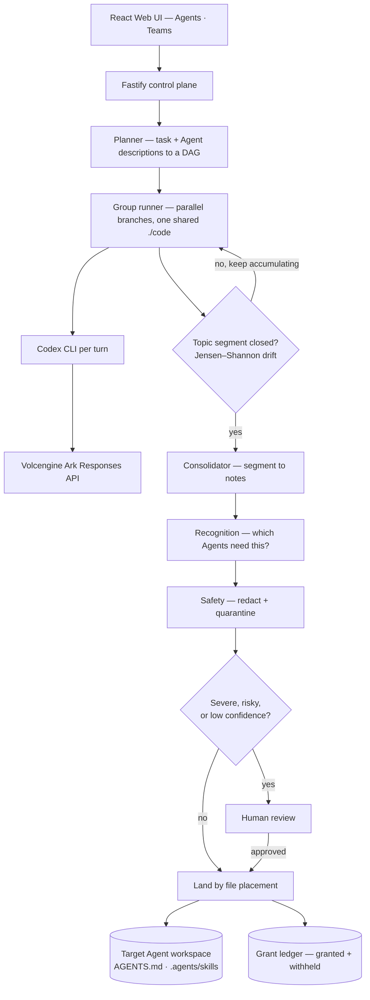

# Volc Agent Launchpad — Governed Cross-Agent Memory

An Agent platform with a **governed memory middleware** on top. Agents run in
isolated Codex sessions, so whatever one works out normally dies with its run.
This platform captures that knowledge from a shared task, decides which other
Agents may receive it, writes it into their workspaces as native Codex memory,
and records every grant **and every denial** with a named reason.

The base platform gives you Agent CRUD, a browser Playground, persistent
workspaces, and Codex CLI backed by the Volcengine Ark Responses API. The
middleware adds Teams, planned multi-Agent tasks, and the memory pipeline.

Run it locally with Docker, Colima, or rootless Podman, or deploy it to
Volcengine ECS.

> [!WARNING]
> This is a single-user proof of concept. It intentionally has no identity,
> tracing, audit, or hardened sandbox middleware. Do not use production data or
> credentials. See [SECURITY.md](SECURITY.md).

## Screenshots

### Agent Playground


### Create an Agent


## Features

**Base platform**

- React and TypeScript Web UI
- Agent create, edit, start, stop, delete, and multi-turn chat
- Fastify control plane with asynchronous Run state
- Persistent Agent workspaces and Codex sessions
- Disposable Docker, Colima, or Podman container for each local turn
- Docker and Terraform deployment paths for Volcengine ECS

**Governed memory middleware**

- **Teams** — put several Agents on one goal, over one shared `./code` tree
- **Planner** — reads the task and each Agent's description, then builds the
  execution DAG; independent branches run in parallel
- **Topic segmentation** — memory is consolidated per *topic segment* (a run of
  consecutive tasks on one subject), detected with Jensen–Shannon divergence,
  not per individual task
- **Recognition** — decides *which* Agents receive each note, by embedding
  similarity rather than by asking the extractor to guess
- **Safety + human review** — secret redaction and a quarantine heuristic run
  before anything is written; severe, redacted, quarantined, and low-confidence
  notes go to a human
- **Landing by placement** — a note reaches an Agent **iff** a file was written
  into that Agent's workspace. That is the whole security boundary.
- **Grant ledger** — append-only record of who received what, and who was
  denied and why

## Requirements

- Node.js 22+
- npm 10+
- Docker, Colima, or Podman
- A Volcengine Ark API key and endpoint that supports the Responses API
- **Git LFS** — the recognition checkpoint (87 MB) ships via LFS
- *Optional:* Python 3.10+ — only for the local SBERT recognizer

Codex CLI is included in the Runtime image and is not required on the host.

---

# Full setup

## 1. Check local tools

```bash
node --version          # 22+
npm --version           # 10+
git lfs version         # required for the recognition checkpoint
docker --version        # Docker Desktop, Docker Engine, or Colima
podman --version        # use this instead when running Podman
```

Only one container engine is required. If `git lfs` is missing, install it
(`brew install git-lfs`, `apt install git-lfs`) — otherwise the model file
arrives as a small text pointer instead of real weights.

## 2. Clone, including the model

```bash
git lfs install
git clone <repository-url> volc-agent-launchpad
cd volc-agent-launchpad
git lfs pull            # fetches data/recognition/model (87 MB)
```

Verify the checkpoint is real weights and not a pointer stub:

```bash
ls -lh data/recognition/model/model.safetensors   # expect ~87M, not ~133 bytes
```

## 3. Start the POC

```bash
ARK_API_KEY=your-ark-api-key \
ARK_MODEL=ep-your-endpoint-id \
npm run poc
```

The first run installs Node.js dependencies and builds the Runtime image. The
script selects Docker, Colima, or Podman automatically, and exports
`RUNTIME_PROVIDER=container` for you.

> `npm run poc` does **not** read `.env` — only `docker compose` does. Pass
> `ARK_*` on the command line as above. See [Configuration](#configuration) for
> why exporting all of `.env` breaks a bare host run.

## 4. Open the browser

Visit <http://localhost:3000>, or from the terminal:

```bash
open http://localhost:3000       # macOS
xdg-open http://localhost:3000   # Linux desktop
```

**Solo Agent:**

1. Select **Create Agent**, give it a name, description, and instructions.
2. Enter a task in the Playground, for example:

   ```text
   Create a TypeScript hello-world CLI, add a test, and run it.
   ```

**Team with governed memory:**

1. Create at least **two** Agents with distinct descriptions — the planner and
   the recognizer both read `description`, so make them meaningful
   (e.g. "Backend API and storage work", "Auth, validation, secret boundaries").
2. Switch to **Teams**, create a team, and give it one goal.
3. Watch the plan execute, then open **Review**, **Ledger**, and **Workspaces**
   to see which Agent received which note, and who was denied.

## 5. Seed the demo dataset (optional)

Loads a completed task through the **real** governance pipeline, so every
screen has data:

```bash
npm run seed
```

Restart the server afterwards — the store is read into memory at boot.

## 6. Enable the local SBERT recognizer (optional)

Everything above runs on the default `MEMORY_RECOGNIZER=fake`, which is
deterministic and offline. To use the trained checkpoint instead:

```bash
python3 -m venv .venv-recognition
source .venv-recognition/bin/activate
pip install -r apps/server/requirements-sbert.txt
```

Smoke-test the bridge — it must return a non-empty vector:

```bash
printf '{"texts":["The API must reject expired access tokens."]}' | \
  python scripts/embed-recognizer.py --model-path data/recognition/model
```

Then set in your environment:

```dotenv
MEMORY_RECOGNIZER=sbert
MEMORY_RECOGNITION_AGENT_THRESHOLD=0.72
```

> The Python environment is **per machine** and is never committed — torch
> alone is 322 MB, past GitHub's file limit. Only the checkpoint ships, via LFS.

> [!IMPORTANT]
> **Automatic grants stay off.** While `MEMORY_AUTO_GRANT_ENABLED=false`, the
> server forces every SBERT-routed note through human review. The checkpoint
> was calibrated on *synthetic* data; a maintainer must review an independent
> holdout and recalibrate against human labels before enabling auto-grant. See
> [MANIFEST_RECOGNITION.md](manifest/MANIFEST_RECOGNITION.md).

## 7. Stop and resume

Press `Ctrl+C` in the startup terminal. The script removes temporary Runtime
containers but keeps Agent workspaces and conversations.

- macOS state: `~/.volc-agent-launchpad/`
- Linux state: `.local/`
- Custom location: set `LOCAL_POC_DATA_ROOT`

### Select a specific container engine

```bash
CONTAINER_ENGINE=podman \
ARK_API_KEY=your-ark-api-key \
ARK_MODEL=ep-your-endpoint-id \
npm run poc
```

Colima uses `CONTAINER_ENGINE=docker` because it exposes the Docker CLI. For a
clean Linux host, follow the
[rootless Podman setup](docs/LOCAL_POC.md#rootless-podman-on-linux).

---

## Docker Compose

```bash
./scripts/bootstrap-local.sh
```

Required values in `.env`:

```dotenv
ARK_API_KEY=your-ark-api-key
ARK_MODEL=ep-your-endpoint-id
APP_AUTH_TOKEN=replace-with-at-least-24-random-characters
```

```bash
docker compose up --build     # then open http://localhost:3000
docker compose down           # stops without deleting Agent data
```

## Development

```bash
npm install
npm install --global @openai/codex@0.111.0
APP_DATA_DIR="$PWD/.data" \
AGENT_WORKSPACE_ROOT="$PWD/workspaces" \
CODEX_HOME="$PWD/codex-home" \
npm run dev
```

- Web UI: <http://localhost:5173>
- API: <http://localhost:3000>

> [!WARNING]
> **Do not `source .env` for a bare host run.** The committed `.env` is the
> *container* profile: it sets `APP_DATA_DIR=/app/data` and friends, which do
> not exist on a host, and the server exits with
> `ENOENT: no such file or directory, mkdir '/app'`. Export only the `ARK_*`
> keys, and pass the three absolute paths above.

Those same three paths matter when seeding, or the seed writes to a different
store than the server reads:

```bash
APP_DATA_DIR="$PWD/.data" \
AGENT_WORKSPACE_ROOT="$PWD/workspaces" \
CODEX_HOME="$PWD/codex-home" \
npm run seed
```

## Deployment

- [Existing Linux ECS with Docker](docs/DEPLOYMENT.md#existing-linux-ecs)
- [Complete Volcengine environment with Terraform](docs/DEPLOYMENT.md#terraform-deployment)
- [Local Docker, Colima, and Podman details](docs/LOCAL_POC.md)

```bash
cp .env.example .env.production
./scripts/deploy-existing-ecs.sh .env.production
```

The Terraform path provisions VPC, subnet, security group, ECS, and EIP:

```bash
cp deploy/volcengine/terraform.tfvars.example \
  deploy/volcengine/terraform.tfvars
./scripts/deploy-volcengine.sh
```

## Configuration

**Base platform**

| Variable | Default | Purpose |
| --- | --- | --- |
| `ARK_API_KEY` | Required | Ark model API key. |
| `ARK_MODEL` | Required | Responses-capable endpoint or model ID. |
| `ARK_BASE_URL` | Beijing v3 endpoint | Ark OpenAI-compatible API URL. |
| `APP_AUTH_TOKEN` | Empty on loopback | Shared demo token; use 24+ random characters remotely. |
| `RUNTIME_PROVIDER` | `local-process` | `container` for disposable local Runtime containers. |
| `CODEX_SANDBOX_MODE` | `workspace-write` | Codex inner sandbox mode. |
| `CODEX_TIMEOUT_MS` | `600000` | Maximum duration of one turn. |
| `GROUP_MAX_PARALLEL_NODES` | `4` | How many plan nodes of one task may run at once. |
| `LOCAL_POC_DATA_ROOT` | Platform-specific | Local metadata, workspace, and session directory. |

**Memory extraction**

| Variable | Default | Purpose |
| --- | --- | --- |
| `MEMORY_ENABLED` | `true` | Master switch; `false` restores the exact baseline. |
| `MEMORY_EXTRACTOR` | `ark` | `ark` \| `fake` \| `off`. Falls back to `fake` automatically when `ARK_*` is unusable. |
| `MEMORY_EXTRACT_TIMEOUT_MS` | `30000` | Consolidator model-call timeout. The code default is low for real runs; `.env.example` raises it to `120000`. |
| `REVIEW_ALL_SKILLS` | `false` | Force every note through human review. |
| `SKILLS_DIR` | `.agents/skills` | Where landed skills go inside each workspace. |

**Topic segmentation**

| Variable | Default | Purpose |
| --- | --- | --- |
| `MEMORY_TOPIC_DRIFT_THRESHOLD` | `0.90` | JS-divergence score above which the subject counts as changed. |
| `MEMORY_SEGMENT_MAX_TASKS` | `8` | Hard cap: close a segment after this many tasks. |
| `MEMORY_SEGMENT_MAX_CHARS` | `120000` | Hard cap on transcript size. |
| `MEMORY_SEGMENT_IDLE_MS` | `1800000` | Close an untouched segment on the next group read. |

**Recognition (routing)**

| Variable | Default | Purpose |
| --- | --- | --- |
| `MEMORY_RECOGNIZER` | `fake` | `fake` \| `ark` \| `sbert` \| `off`. |
| `MEMORY_RECOGNITION_AGENT_THRESHOLD` | see note | Similarity floor for routing to an Agent. Use `0.72` with the shipped checkpoint. |
| `MEMORY_RECOGNITION_SKILL_THRESHOLD` | `0.45` | Similarity floor for matching an existing skill. |
| `MEMORY_AUTO_GRANT_ENABLED` | `false` | Must stay `false` until a reviewed holdout authorizes auto-grant. |
| `MEMORY_SBERT_PYTHON` | `python3` | Interpreter for the bridge. |
| `MEMORY_SBERT_MODEL_DIR` | `data/recognition/model` | Checkpoint directory. |
| `MEMORY_SBERT_BRIDGE` | `scripts/embed-recognizer.py` | Inference bridge path. |
| `MEMORY_EMBEDDING_TIMEOUT_MS` | `30000` | Embedding call timeout. |

See [.env.example](.env.example) for the annotated full list.

## How it works



Security is **file placement**: deterministic, and ours. Relevance is Codex's
own skill matcher: model-driven, and theirs. We did not reinvent retrieval — we
drew a hard line around who may receive what.

The first turn uses `codex exec`; later turns resume the stored Codex thread.
Deleting an Agent archives its workspace under `workspaces/.deleted/`.

## Validation

```bash
npm run check                                   # typecheck + tests + build
terraform fmt -check -recursive deploy/volcengine
docker compose config
```

`npm run check` stays fully offline: `MEMORY_EXTRACTOR` falls back and
`MEMORY_RECOGNIZER` defaults to `fake`, so no test touches the network.

After a real end-to-end run, diagnose it with:

```bash
LOCAL_POC_DATA_ROOT=$HOME/.volc-agent-launchpad npm run verify:live
```

This checks the things that otherwise fail **silently** — an empty shared
`./code`, real Codex spans that the consolidator filters out to zero notes, and
governed memory escaping into `$CODEX_HOME` or shared code.

## Documentation

**The middleware** — start with `MIDDLEWARE.md`, then `ARCHITECTURE.md`:

- [Problem, trust boundary, enforcement point](middlewaredoc/MIDDLEWARE.md)
- [Architecture and honest limits](middlewaredoc/ARCHITECTURE.md)
- [Contracts: types, store, routes](middlewaredoc/SPEC.md)
- [Group chat and thread model](middlewaredoc/GROUP-CHAT-DESIGN.md)
- [Component designs](middlewaredoc/components/) — planner, consolidator,
  recognition, safety, landing, ledger, review
- [Demo script](middlewaredoc/DEMO.md)
- [Build status: what is proven, what is not](middlewaredoc/BUILD-REVIEW.md)

**Integration manifests** — read before merging branches:

- [Topic segmentation](manifest/manifest_KL.md)
- [Recognition](manifest/MANIFEST_RECOGNITION.md)

**Base platform**

- [Architecture](docs/ARCHITECTURE.md)
- [Local POC](docs/LOCAL_POC.md)
- [Deployment](docs/DEPLOYMENT.md)
- [Hackathon extension guide](docs/HACKATHON_EXTENSION_GUIDE.md)
- [Security policy](SECURITY.md)
- [Contributing](CONTRIBUTING.md)

## License

[MIT](LICENSE)
