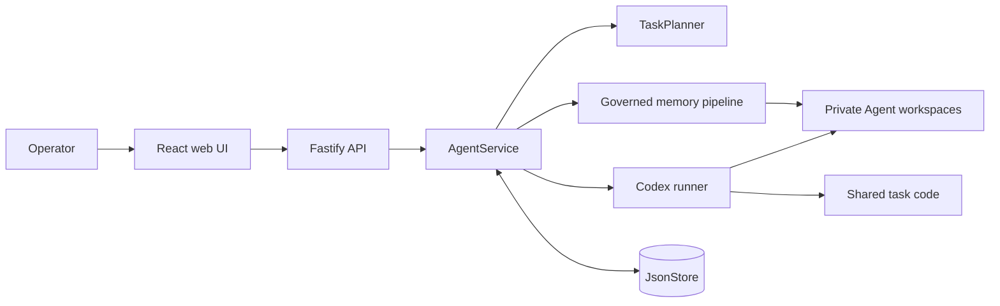
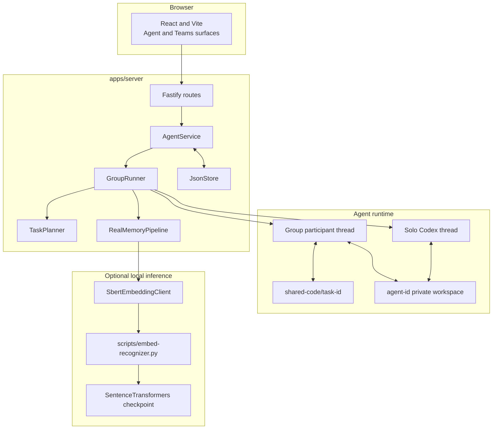
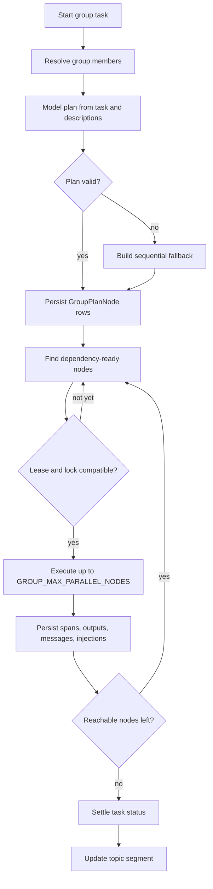
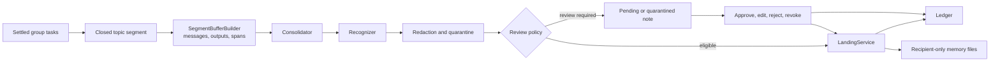
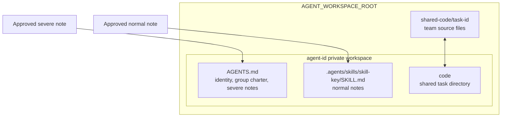

# Architecture

## Purpose

Volc Agent Launchpad is a single-user multi-Agent coding platform. It combines
task-specific group orchestration with governed cross-Agent memory. Each Agent
has a private workspace and private Codex session; knowledge crosses Agent
boundaries only through a persisted note, an explicit routing decision, and a
file placed in the receiving Agent's workspace.

The platform has two major paths:

1. A group task is planned into a validated dependency graph and run against a
   shared task code directory.
2. A closed topic segment is converted into durable notes, routed, checked,
   reviewed when needed, landed, and audited.

## Design Principles

| Principle | Implementation consequence |
| --- | --- |
| Private by default | Each Agent has a workspace, solo thread, and group participant thread distinct from every other Agent. |
| Explicit collaboration | A group has 2-12 unique members. Roles are display labels; they do not grant access or select work. |
| Untrusted model output | Planner and extractor output is parsed, index-resolved, bounded, and validated before persistence. |
| Extracting is not granting | Consolidation identifies durable knowledge only; recognition selects potential recipients. |
| Placement is enforcement | Governed memory is available only if LandingService wrote it under the recipient's private workspace. |
| Review before risk | Safety findings and uncertain or broad routes are parked for a human before activation. |
| Task completion is independent | Memory errors never retroactively fail a completed or partial group task. |
| Evidence is persisted | Runs, spans, plans, context injections, notes, landed files, and grants drive the UI and audit views. |

## Component Topology

apps/server owns configuration, Fastify routes, persistence, execution,
planning, and memory. apps/web is the operator interface. The server runs Codex
locally or in a configured container engine. The SBERT bridge is a local Python
process invoked by the Node server; it is not a separate HTTP backend.

## Group Task Lifecycle

### Membership and planning

A group contains 2-12 explicitly chosen, non-duplicate Agents. The planner
receives the new task prompt plus each candidate's name and description. It can
choose a subset and produce up to eight task nodes. A node includes an Agent
index, dependency indices, instruction, expected output, work area, and write
intent.

The server resolves small indices to real ids and rejects invalid plans. It
checks non-empty instructions, node count, known Agents, valid dependencies,
self-dependencies, duplicate dependencies, and cycles. Work areas map through
a server-owned allowlist to file ownership hints and runtime locks. The model
does not author arbitrary paths or UUIDs.

If planning is unavailable or invalid, the runtime uses one sequential fallback
node per group member. This preserves a runnable, deterministic group task.

### Execution

The runner executes dependency-ready nodes up to GROUP_MAX_PARALLEL_NODES
(default 4). It will not run two nodes that require the same Agent lease or
overlapping runtime locks. It creates and records context injection before a
node executes, and persists node output and streamed trace spans as it runs.
Failure and cancellation settle unavailable descendants, release leases and
locks, and allow a task to become partial when completed branches remain useful.

### Workspaces and threads

- A solo run resumes Agent.codexThreadId unless it starts fresh.
- A group run uses GroupParticipantState.groupThreadId, preserving the solo
  session.
- Every group task owns shared-code/task-id, exposed to selected group nodes as
  ./code.
- Agent-specific AGENTS.md task blocks give group context without turning the
  workspace into a shared memory root.
- GroupContextInjection records which messages and dependency outputs were
  supplied to a node and which were withheld.

## Topic-Segment Memory Flow

The unit of consolidation is a TopicSegment: consecutive tasks for one group
that stay on a coherent subject. A segment closes on a prompt-topic shift, task
or character cap, or an idle sweep. Only a closed, unflushed segment whose
contained tasks are settled can enter memory processing.

SegmentBufferBuilder reconstructs inputs from persisted state: prompts, group
conversation, node outputs, run ids, trace spans, and context-injection
metadata. This avoids a second live transcript store and gives consolidation
durable provenance.

The detailed contract is in [MEMORY_PIPELINE.md](MEMORY_PIPELINE.md).

## Memory Placement Boundary

The landing service is the only governed-memory writer:

- Severe notes are managed memory blocks in a recipient's AGENTS.md.
- Normal notes are managed blocks in a recipient's private SKILL.md file.
- Revocation removes the note's specific block or skill placement and records a
  revocation. It affects future runs, not content already present in a live
  model context.
- Regenerating Agent instructions preserves managed memory blocks.

The filesystem is the availability state. The ledger proves that this middleware
granted, withheld, rejected, or revoked a note; it cannot prove that Codex used
the note during a future turn.

## Persistence Model

JsonStore persists a versioned launchpad.json through serialized mutation,
temporary-file write, and rename. It is suitable for a local, single-user POC.

| Domain | Persisted records |
| --- | --- |
| Solo work | Agent, Message, AgentRun, TraceSpan |
| Group work | AgentGroup, GroupTask, GroupParticipantState, GroupPlanNode, GroupMessage, GroupContextInjection, GroupRuntimeLock |
| Segmentation | TopicSegment |
| Memory | MemoryNote, MemorySkillAssignment, LandedMemoryFile, GrantRecord |

## API and UI

The Fastify API provides agent CRUD, messages, runs, live trace inspection,
group CRUD, task lifecycle, timeline, context injection, notes, review actions,
revocation, landed memory, and task grant history. The React UI presents the
Agent workspace and a Teams workspace with conversation, plan, context, review,
ledger, workspaces, proof, and history views.

## Trust Model and Limits

### What the application enforces

- Recipients are selected from Agents who participated in the segment.
- Existing-skill lookup reads only a selected Agent's private skill directory.
- Landing writes only to the intended private workspace path.
- Safety findings, human actions, and grant outcomes are stored.
- A note withheld by this pipeline is not placed in that Agent's workspace.

### What it does not claim

- It is not an identity, authorization, or multi-tenant system. Reviewer names
  provide attribution only.
- Pattern redaction and quarantine are not complete defenses against secrets or
  prompt injection.
- The system cannot observe whether Codex actually invoked a skill or used a
  memory.
- The placement boundary does not replace container or host hardening against a
  malicious runtime.
- The JSON store is not a transaction database for concurrent instances.

## Failure Behavior

| Condition | Behavior |
| --- | --- |
| Invalid planner output or planner failure | Use deterministic fallback plan. |
| Unusable Ark configuration | Startup chooses fake planner/extractor and warns. |
| Missing SBERT prerequisites | Runtime chooses fake embeddings and warns. |
| Recognition error | Withhold candidate note; never guess recipients. |
| Safety error | Quarantine candidate note. |
| Memory pipeline error | Log error; do not fail a settled group task. |
| Resume of partial work | Remove earlier auto notes for the segment and consolidate the full later result; retain human decisions. |

## Implementation Map

| Concern | Primary source |
| --- | --- |
| Startup and configuration | apps/server/src/index.ts, config.ts |
| HTTP API | apps/server/src/app.ts |
| Service facade | apps/server/src/agent-service.ts |
| Group scheduling | apps/server/src/memory/group-runner.ts |
| Planning | apps/server/src/memory/planner.ts |
| Segments and buffers | topic-segment.ts, flush-trigger.ts, task-buffer.ts |
| Memory | pipeline.ts, consolidator.ts, recognizer.ts, safety.ts, review.ts, landing.ts, ledger.ts |
| Workspace management | apps/server/src/workspace.ts |
| Operator UI | apps/web/src and apps/web/src/group |

See [OPERATIONS.md](OPERATIONS.md) for setup, configuration, and verification.
