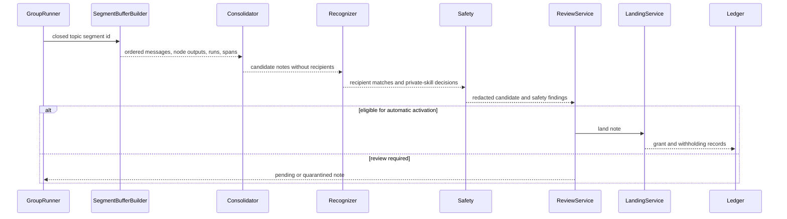
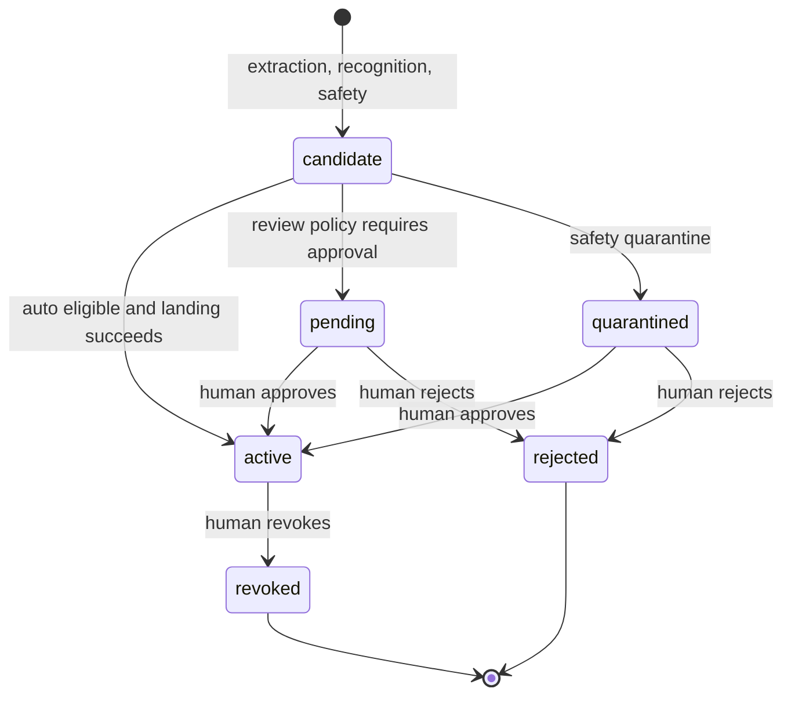

# Governed Memory Pipeline

## Objective

The memory pipeline carries durable, relevant knowledge from completed group work
into selected Agents' future workspaces without exposing all group context to
every Agent. It processes a closed topic segment, not an individual chat message
or raw transcript dump.

The core separation is deliberate:

- Consolidation decides what reusable knowledge exists.
- Recognition decides which active segment participants may receive it and which
  private skill it belongs to.
- Safety and review decide whether a note may be activated now.
- Landing makes approved memory available by placing a file in the selected
  Agent's private workspace.

## End-to-End Contract

The pipeline is intentionally non-fatal to group execution. If extraction or
memory processing fails, the group task keeps its own completed, partial,
failed, or cancelled outcome. If recognition fails for one candidate, that
candidate is withheld rather than guessed or broadly landed.

## Topic Segments and Flushes

A TopicSegment groups consecutive tasks in one team while the subject holds. It
opens with the first task, continues when a new prompt remains related, and
closes on one of these boundaries:

- topic_shift: the JavaScript topic-drift policy exceeds
  MEMORY_TOPIC_DRIFT_THRESHOLD.
- size_cap: the segment reaches MEMORY_SEGMENT_MAX_TASKS or
  MEMORY_SEGMENT_MAX_CHARS.
- idle: no activity for MEMORY_SEGMENT_IDLE_MS; the next group read lazily
  sweeps and closes it.

Only a closed, unflushed segment whose tasks are settled is consolidated. This
gives the extractor context across multiple tasks while preventing an unbounded,
permanent team transcript.

SegmentBufferBuilder reads persisted state back from JsonStore and creates a
SegmentBuffer containing:

- group id, segment id, and ordered group task prompts;
- human and Agent group messages over the segment sequence range;
- completed plan-node outputs in execution order;
- trace spans and their run ids;
- persisted context-injection metadata.

## Consolidation

Consolidator calls the configured extractor once per closed segment and asks for
at most eight declarative, durable notes. It is an extractor, not a chat summary
and not an access-control decision maker.

| Field | Meaning |
| --- | --- |
| content | Reusable declarative fact, decision, constraint, or lesson; maximum 2,000 characters. |
| severity | normal or severe. Severe information is always-on after approval. |
| skillKey | Kebab-case reusable topic key. It is never treated as a filesystem path. |
| description | Future-task relevance trigger for a normal skill. |
| sourceRunIndices and sourceSpanIndices | Small integer citations into the extractor prompt. The server resolves them to real persisted ids. |
| rationale | Why the note is worth retaining. |

The model is never asked to copy UUIDs. The server validates and resolves
1-based short indices to real sourceRunIds and sourceSpanIds, dropping bad or
duplicate citations instead of accepting arbitrary identifiers.

If the extractor times out, fails, returns invalid JSON, or supplies no durable
notes, the segment produces no new memory. That outcome does not fail the task.

## Recognition

Recognition is the sole recipient-selection authority. It embeds the combined
note description and content, then compares it to every Agent that participated
in work anywhere in the segment.

### Agent routing

1. Build an Agent profile from name, description, and instructions.
2. Select every participant at or above MEMORY_RECOGNITION_AGENT_THRESHOLD.
3. If no participant crosses the threshold, choose exactly one top-scoring
   participant as a fallback match.
4. Persist routing scores and match kind with the candidate note.

| Provider | Behavior |
| --- | --- |
| sbert | Runs a local CPU SentenceTransformers checkpoint through the tracked Python bridge. This is the default. |
| ark | Uses an OpenAI-compatible Ark embeddings endpoint. |
| fake | Deterministic offline embeddings for tests and fallback operation. |
| off | Disables recognition; candidates are withheld because there is no routing authority. |

When SBERT prerequisites are missing or appear to be an LFS pointer rather than
weights, the runtime warns and falls back to fake. It does not download a model
or make an implicit network call.

### Per-Agent skill routing

For every recognized recipient, the pipeline reads only that Agent's private
.agents/skills/SKILL.md metadata. It embeds the note and each existing skill
profile:

- An existing skill at or above MEMORY_RECOGNITION_SKILL_THRESHOLD receives the
  note as a managed block.
- Otherwise, the candidate proposes a new skill using the consolidator's
  skillKey and description.
- If the proposed key collides with an unrelated existing skill, the candidate
  is withheld rather than merged implicitly.

The system never searches a different Agent's skill directory in order to choose
a recipient's memory location.

## Safety

Safety executes before review and before any filesystem write.

### Redaction

The redactor replaces detected sensitive values with [REDACTED_SECRET] in both
note content and description. Its recall-oriented patterns include bearer tokens,
private keys, database URLs, environment assignments, and long key-shaped
tokens.

### Quarantine

The quarantine heuristic flags instruction override, hidden-prompt or secret
requests, safety-disablement, exfiltration, and suspicious shell exfiltration
shapes. If safety itself errors, the note is quarantined. It never fails open.

These checks reduce obvious risk but are not a complete secret classifier,
policy engine, or defense against every adversarial input. Human review is part
of the design, not a backup for a claim of perfect detection.

## Review Policy

ReviewService persists every candidate and then either activates it or parks it
as pending or quarantined.

A candidate requires human review when any of these apply:

- REVIEW_ALL_SKILLS=true;
- the note is severe;
- redaction fired;
- quarantine fired;
- Agent routing used a fallback;
- any recipient needs a new skill.

Additionally, startup sets review-first behavior for MEMORY_RECOGNIZER=sbert
unless MEMORY_AUTO_GRANT_ENABLED=true. This prevents a checkpoint calibrated
only on synthetic labels from granting memory automatically.

The operator can approve, edit, reject, or revoke through the note API and the
Teams UI. An edit can change content, severity, recipients, and description;
it may be saved for later or approved immediately.

## Note Lifecycle

Candidate is transient persisted state used while landing. A note becomes active
only after the landing service has written its governed file or files.

## Landing and Revocation

LandingService is the only service that places governed memory in a private
workspace. It records a LandedMemoryFile and delegates grant and withholding
records to LedgerService.

| Note type | Landing target |
| --- | --- |
| Severe | Managed memory block in the recipient AGENTS.md. |
| Normal | Managed block in .agents/skills/skill-key/SKILL.md for that recipient. |

Landing is idempotent through managed block replacement. Revocation removes only
the note's block or generated skill placement and records a revoked ledger event.
Editing Agent instructions preserves governed memory blocks.

The platform records a grant for each recipient and a named withholding reason
for non-recipients. It proves availability and denial at placement time, not
whether a later model invocation used the content.

## Resume Semantics

When a group task resumes after a partial result, the pipeline removes
auto-generated notes and their landing and ledger artifacts for the affected
topic segment. It reopens the segment so later consolidation sees the full final
transcript. Human-decided notes, including approved, rejected, and revoked
records, are retained.

## Automatic Grant Gate

Do not set MEMORY_AUTO_GRANT_ENABLED=true solely from a synthetic evaluation.
Before enabling it in any environment:

1. Generate an independent human-reviewed holdout that includes out-of-scope
   and near-threshold notes.
2. Calibrate the selected model and threshold against those human labels.
3. Confirm the false-grant target and record the report, data origin,
   threshold, and approver.
4. Deploy the approved model and exact Python dependencies, then enable the
   flag only for that environment.

See [OPERATIONS.md](OPERATIONS.md) for configuration and local runtime setup.
