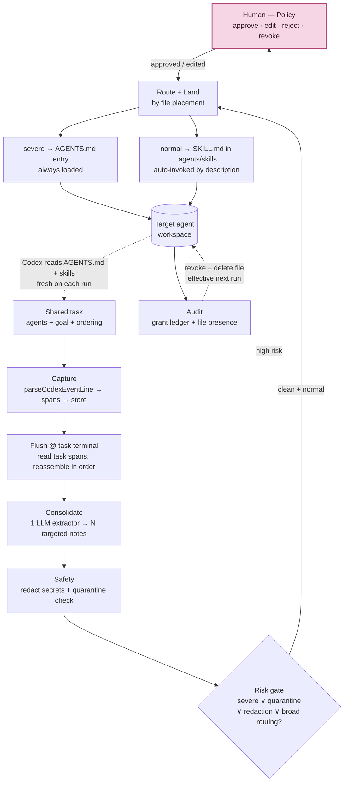

# Governed Cross-Agent Memory — Architecture

> **This is the canonical design.** It records *what* we're building and *why*.
> It does not carry the buildable spec (consolidator schema, validation ladder,
> exact field lists) — that is deferred to a later `SPEC.md`, and several items
> are still open (see §11). Where this file disagrees with anything in
> [`../outdated/`](../outdated/), this file wins.

---

## 1. What we're building

Every agent on this platform runs in its own isolated Codex session. Anything an
agent figures out — a decision, a constraint, a hard-won fact — dies with the run
that produced it. It never reaches the next agent that needs it.

We add a middleware layer that changes that, **under human control.** In the
context of a *shared task* (a group of agents working toward one goal, however
they're orchestrated), it captures the important context each agent produces,
distills it into reusable notes, decides which other agents should receive each
note, and writes those notes into the recipients' workspaces as memory the agent
loads on future runs — with a human gate on anything high-impact.

The one-line version:

> Agents earn knowledge in isolated sessions and lose it. Our middleware captures
> that knowledge from a shared task, governs who may receive it, lands it as
> native Codex memory in the right agents, and records every grant and denial.

---

## 2. The problem

Each agent owns a private `codexThreadId`, resumed every turn (`apps/server/src/types.ts`).
So carryover *within* one agent is already free — the session handles it.
Carryover *across* agents is impossible — there is no shared path. And the naive
fix, dumping the whole group transcript into every agent, leaks scope, drifts
roles, and grows the prompt without limit.

The gap isn't "memory." It's **governed** memory:

- **capture** with provenance (which run, which spans),
- **decide** who may receive what,
- **land** it where the agent will actually use it,
- **prove** both the grant and the denial.

---

## 3. The contribution — legible governance

Observability tools (LangSmith, Langfuse) answer *what did the agent do?* Memory
products (ChatGPT Projects, Claude memory) *share* one user's context across
their chats — every chat sees everything, with no way to grant a memory to one
agent while withholding it from another.

We answer a question nothing else does: **what did the agent know, and what was it
denied knowing — and why?**

The mechanism that makes this *governance* and not "an LLM guessing at access
control" is a clean split:

| | Enforced by | When | Nature |
|---|---|---|---|
| **Security** — *who may receive a memory* | **file placement** (we write the note into an agent's workspace, or we don't) | write time | deterministic, hard, ours |
| **Relevance** — *when a memory applies to a task* | **Codex-native skill matching** (the skill's `description`) | read time | model-driven, soft, Codex's |

Security is a hard boundary we own: if a note was never written into Ops's
workspace, Codex *cannot* load it — the file isn't there. Relevance is the soft
part, and we hand it to Codex's native matcher rather than reinventing it.

This also turns our biggest constraint into a strength. We do not claim perfect
retrieval. We claim retrieval and denial you can **see and correct**: every grant
and every withholding is a recorded decision with a named reason, and the current
grant state is just the set of files in each agent's workspace — inspectable at
any moment.

---

## 4. How it works — the full pipeline



### The stages

A human sits above the pipeline as **policy**; the middleware runs the rest.

1. **Shared task** — a group of agents works toward one goal in a fixed order
   (sequential now; a DAG later). Orchestration-agnostic: the governance layer
   never inspects *how* the order was chosen.
2. **Capture** — each agent's run is parsed into ordered, causally-linked spans by
   the existing `parseCodexEventLine`, buffered, and flushed to the store when that
   run ends.
3. **Flush @ task terminal** — when the *whole task* finishes (last agent done), we
   read the task's spans back and reassemble them in chain order. **One flush per
   task, not per run** — that's what lets a single pass see *across* agents and
   catch constraints that only exist at the seam between them.
4. **Consolidate** — one lightweight LLM, acting as an **extractor** (not a
   summarizer), turns the transcript into *many* targeted notes. Each carries
   content (declarative), severity, target agents, a `description` (its relevance
   trigger), and source span ids. **Routing is folded in here — no separate
   classifier.**
5. **Safety** — every note is redacted (secrets stripped) and run through the
   quarantine heuristic **before** anything is written.
6. **Risk gate (HITL)** — a note goes to a human if it is
   `severe ∨ quarantine-hit ∨ redaction-fired ∨ broadly-routed`; the human
   approves, edits (content / severity / routing / `description`), or rejects.
   Everything clean and normal auto-activates.
7. **Route + land** — the note is written **by placement** into each target agent's
   own workspace: severe notes as always-loaded `AGENTS.md` entries, normal notes
   as `SKILL.md` files Codex auto-invokes when their `description` matches. This is
   the single enforcement point — a note reaches an agent **iff** a file was written
   into that agent's workspace.
8. **Feedback** — on its next run, each agent reads its `AGENTS.md` and skills fresh
   from its workspace filesystem. That is how landed memory reaches future runs.
9. **Audit** — a write-time grant ledger records, per note, who it was granted to,
   who it was withheld from and why, and the HITL decision. The workspace file
   presence self-evidences the live enforcement state.
10. **Revoke** — deleting the file removes the memory from the next run. (Caveat:
    content already absorbed into a live resumed thread lingers until reset.)

---

## 5. The Codex mechanisms it rides on

These are verified against OpenAI's current Codex docs and this codebase — the
design does not invent any mechanism.

- **`AGENTS.md` — always loaded.** Codex reads `AGENTS.md` from the working
  directory into context on **every** run. This codebase already writes one per
  agent (`apps/server/src/workspace.ts` → `writeInstructions()`), and
  `codex exec -C <workspacePath>` runs with the agent's workspace as cwd. So a
  note appended here is in context on every subsequent run. → **severe path.**

- **Skills — native, auto-invoked when relevant.** A skill is a `SKILL.md` file
  with frontmatter `name` + `description` + an instructions body. **The
  `description` is the sole relevance-matching signal**: *"Codex can choose a skill
  when your task matches the skill `description`."* Skills are **project-scoped by
  cwd** (`<cwd>/.agents/skills`), so a skill written into an agent's workspace is
  available to **that agent only.** → **normal path.**

  > ✅ **Verified on the pinned runtime** (`@openai/codex@0.111.0`, via the
  > `skills/list` app-server RPC). Both `<cwd>/.agents/skills/<name>/SKILL.md`
  > and `<cwd>/.codex/skills/<name>/SKILL.md` are discovered and reported with
  > `scope: "repo"`. A workspace with no skill files sees **zero** repo-scoped
  > skills — no cross-workspace leakage. **A git repo is not required.** We use
  > `.agents/skills`.
  >
  > ⛔ **`$CODEX_HOME/skills` is `scope: "user"` — global to every agent.** This
  > deployment shares one `codex-home` across all agents, so anything landed
  > there reaches everyone and would silently void the §3 security claim.
  > Governed memory is **never** written to `$CODEX_HOME`.

- **Reuse of the tracing capture.** `parseCodexEventLine` already parses the Codex
  event stream into typed, ordered, causally-linked spans and flushes them to the
  store at run terminal. We consume those spans; we do **not** modify the runner.

> ⚠️ **Skill invocation is invisible in the `codex exec --json` stream** — there is
> no `skill.loaded` event. Skills load internally via progressive disclosure. This
> is why the audit lives at **write time** (§8) and why the demo should use
> **explicit** `$skill-name` invocation for a deterministic on-stage result (§10).

---

## 6. The severity model

The consolidator assigns each note a severity, and severity maps to a mechanism:

| Severity | Lands as | Loading | For |
|---|---|---|---|
| **Severe** | `AGENTS.md` entry | **always** in context, every run | hard constraints that must never be missed |
| **Normal** | `SKILL.md` in `.agents/skills/` | **on-demand**, auto-invoked when its `description` matches | situational references that only matter sometimes |

Always-on rules go where they can't be skipped; situational references go where
they load only when needed.

### Shared code workspaces — required, not optional

Agents keep **isolated** workspace roots, and that isolation is what makes
placement-based security work (§3). But a group task needs the agents to
**co-edit one codebase**, so the two axes decouple: memory stays per-agent, only
the code is shared. Every group task creates a shared code directory and exposes
it as `./code` inside each participating agent's private root.

```
workspaces/
├── shared-code/<groupTaskId>/   ← the one codebase, edited by all agents
├── backend/
│   ├── AGENTS.md                ← per-agent memory   (isolated)
│   ├── .agents/skills/          ← per-agent skills   (isolated)
│   └── code → shared-code/<groupTaskId>
├── frontend/  … (same shape)
└── security/  … (same shape)
```

Each agent still runs with cwd = its own workspace, so Codex reads `AGENTS.md` and
skills from the **per-agent root** (isolation intact) while edits under `./code`
land in the **shared** directory. The governance layer is untouched — the security
boundary was never "the agent's directory," it was "the memory files the agent
reads," and those stay per-agent.

**The mechanism differs by runtime** (verified — see the A2 decision record):

| Runtime | `./code` is | Sandbox |
|---|---|---|
| `container` (`npm run poc`) | a **nested bind mount** of the shared dir onto `<workspace>/code` | inside cwd, so `workspace-write` permits it natively |
| `local-process` (Compose/ECS) | a **symlink** to `shared-code/<groupTaskId>` | outside cwd, so the run needs `codex exec --add-dir` |

A symlink is **broken** under the container runtime — the target resolves outside
the mounted workspace. Do not use one there.

**Never** place `AGENTS.md` or `.agents/skills/` inside `shared-code/`: the link
points *from* each private workspace *to* shared code, never the reverse, or
isolation breaks. A parallel DAG would inherit the ordinary shared-codebase
concurrency problem (git worktrees per agent, or a lock) — a *code* problem, not a
*memory* one; the v1 sequential chain avoids it entirely.

---

## 7. Human-in-the-loop — the authority

HITL is not a bolt-on; it is the authority that makes this *governance*. And it is
doing **more** work here than in a reference-block design, because **a skill is
executable** — Codex follows a `SKILL.md` when it fires. The channel is real:

```
untrusted agent transcript ──consolidator──► note ──► SKILL.md ──► auto-fires as
   (may be prompt-injected)                                        instructions in
                                                                   a DIFFERENT agent
```

So the human gate is the primary control on that channel.

- **Risk-based trigger.** A note goes to a human if **any** of:
  `severe ∨ quarantine-heuristic-hit ∨ redaction-fired ∨ broad-routing`.
  Everything else — a clean, narrowly-routed normal note — auto-activates.
- **What the human does:** approve · **edit** · reject. The edit levers are the
  governance knobs: **content**, **severity**, **routing** (narrow only — never
  widen past the source group's members), and the skill **`description`** (which
  tunes *when* it fires).
- **Filesystem is the state machine.** Nothing reaches a workspace without passing
  the gate. A file present = approved and enforcing. A file absent =
  pending / rejected / quarantined / revoked. No separate "active?" flag needed.

**Auto-path safety** (because the quarantine regex is recall-limited): the
consolidator emits notes in **declarative** form (facts/constraints, not
imperatives), each written skill carries a fixed safety preamble, and an optional
`REVIEW_ALL_SKILLS` config can force every skill through HITL for a high-security
posture.

> Review and debugging are the **same control**: fixing a wrong governance
> decision after a bad run is the same gesture as approving — you edit the note's
> routing, severity, or `description`.

**Attribution, not authentication.** The platform is single-user with no identity
system. Review records *who claims* to have approved (a name the operator sets),
not a verified identity. This must be stated plainly; claiming otherwise would be
a false security claim.

---

## 8. Audit

Because read-time skill invocation is unobservable (§5), the audit lives at
**write time**, as a per-note **grant ledger**:

| Field | Content |
|---|---|
| source | task id, source agent(s), source span ids |
| content | the extracted note + severity |
| **granted** | agents it was written to (which workspaces) |
| **withheld** | agents it was *not* routed to + reason (`out_of_group`, `not_targeted`, `private`) |
| HITL | approved / edited / rejected, by whom, when |
| revoked | if/when the file was deleted |

Two things make this strong even without read-time visibility:

1. **The workspace state self-evidences.** Which skills / `AGENTS.md` entries exist
   in which workspace *is* the live grant state — "does Ops have this memory? the
   file isn't there."
2. **The withheld list is the differentiator, fully captured at write time** —
   denial with a named reason, which nothing else shows.

---

## 9. Orchestration-agnostic — and the deferred DAG

The governance layer never inspects *how* the task's agent order was chosen. It
consumes whatever transcript the task produced. Today that's a **hardcoded
sequential** chain (backend → frontend → security); later it can be a
dependency-graph (DAG) planner. Only the **flush trigger** changes:

| Stage | Flush trigger | Watermark? |
|---|---|---|
| **Sequential (now)** | last agent in the task done | no |
| DAG, whole-task (later) | all sink nodes terminal | no |
| DAG, incremental (maybe) | a window is complete (Flink-style watermark) | yes |

The flush is a **pluggable trigger** behind one seam. Sequential ships; the
watermark is a later chapter. The extractor, routing, and landing never change
across these — we swap the trigger, not the pipeline.

---

## 10. Limitations (documented, honest)

1. **Per-run "did the agent actually load it?" is unobservable.** Codex emits no
   skill-invocation event, so the audit proves a memory was *available* and
   *withheld from others*, not that it *fired* on a given run.
2. **Revocation is next-run, not mid-thread.** Content already absorbed into a
   live resumed Codex thread lingers until that thread resets. (Universal to any
   prompt/context boundary.)
3. **Relevance is model-driven** (Codex's matcher), so it is not deterministically
   testable the way a lexical rule would be.
4. **The store is a single JSON file**, inherited from the starter kit.
5. **Redaction is pattern-based** and cannot catch every shape of secret; the
   quarantine heuristic is recall-tuned and backed by HITL, not perfect precision.
6. **OS-level write isolation between agents comes from the container, not from
   Codex.** All agents run as one process tree inside a single hardened container
   (`cap_drop: ALL`, `no-new-privileges`, pid/memory limits), and Codex's Linux
   Landlock sandbox is **unavailable on Docker Desktop for Mac** (the linuxkit
   kernel ships landlock syscalls as unimplemented weak symbols). A
   prompt-injected agent could therefore, in principle, write into a sibling
   agent's workspace directory. This does **not** weaken the governance claim in
   §3 — that claim is about which memory files *we* place in each workspace, and
   it is enforced by the landing service, audited at write time, and inspectable
   as file presence. It does mean we should not claim OS-enforced agent
   sandboxing. State it this way if asked.

---

## 11. Open items to close before coding

Design shape is settled; the buildable contract is not. Still open:

- **Consolidator contract** — exact prompt, output JSON schema, validation ladder,
  caps, the lightweight model choice.
- **Buffer filtering** — which span types feed the consolidator (keep `reasoning`
  + `agent_message`; drop tool-call noise?).
- **Skill naming** — how a note maps to a `SKILL.md` name/slug.
- **Declarative-form enforcement + exact quarantine patterns.**
- **Data model + store shape** — group, task, note, the audit ledger fields.
- **API surface** — endpoints for tasks, review queue, revoke, ledger.
- **Demo beats** re-mapped onto this design (the "empty workspace can't leak" beat;
  explicit `$skill-name` invocation).

**Build-time verifications — both now CLOSED** (`@openai/codex@0.111.0`):

- ~~Exact skills directory~~ → **`.agents/skills` confirmed working** (`scope: "repo"`).
  `.codex/skills` works identically; either is valid. See §5.
- ~~Skill discovery from a non-git-repo cwd~~ → **confirmed working.** Agent
  workspaces are not git repos and repo-scoped skills are still discovered.

**Residual live-fire check** (one run, once a valid `ARK_API_KEY` exists): that
`codex exec` *fires* a discovered skill, not merely that it discovers one.
`skills/list` proves discovery; the model choosing it is the soft half (§3).
Fold this into the first end-to-end integration run and use explicit
`$skill-name` invocation on stage.
